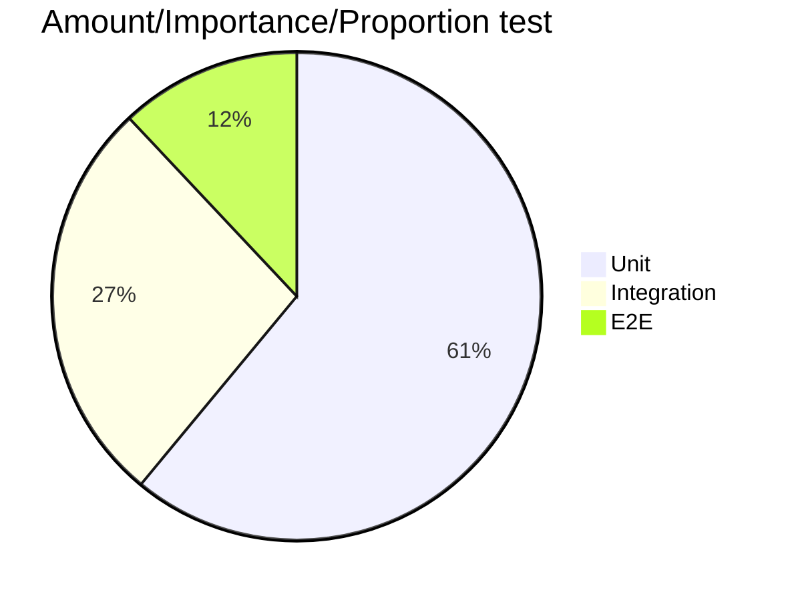

# Testing Concepts

## Introduction
This document provide some annotations and reflexions regarding code testing, particularly in C# .net environment.

Although several resources are provided, it is aimed to be self contained, i.e., it's advised to read the whole document and only afterwards, follow those links the reader want to study in more detail (*disclaimer: with this we don't mean that we expect the reader to blindly believed what we present, rather than we are aware of the endless process of going down the rabbit hole whilst studying documentation which usually leads to dropping the case of study and a whole lot of frustration*).

With this in mind, user can find the complete bibliography at the end of the document.

Sections marked as *optional* go outside the subject of testing but are meant to combat certain myths around testing, as well as to provide more tools for the reader to become a better software engineer (the only real intention of this reading).

### What is a Unit?
We quote some of the most common resources:
 > In procedural programming, a unit could be an entire module, but it is more commonly an individual function or procedure. In object-oriented programming, a unit is often an entire interface, such as a class, or an individual method.
 >
 >*[Wikipedia](https://en.wikipedia.org/wiki/Unit_testing#:~:text=Unit%20tests%20are%20typically%20automated,an%20individual%20function%20or%20procedure.)*  

> The primary goal of unit testing is to take the smallest piece of testable software in the application, isolate it from the remainder of the code, and determine whether it behaves exactly as you expect…
>
>*MSDN*

>Firstly, there is a notion that **unit tests are low-level, focusing on a small part of the** software **system**. Secondly unit tests are usually **written** these days **by the programmers themselves** using their regular tools – the only difference being the use of some sort of unit testing framework. Thirdly unit tests are **expected to be significantly faster** than other kinds of tests.
>
>*[Martin Fowler](https://martinfowler.com/bliki/UnitTest.html)*

Martin Fowler's definition appear as the more rounded and well thought definition (as expected). Condensed as follows.
1. Focus in a small part of the system.
1. Written by the programmers themselves.
1. Expected to run faster.

### Test types
1. Unit testing
    - IO calls are mocked.
    - Smallest scope possible.
2. Component testing (AKA functional testing)
    - Wider scope while keeping minimalistic approach.
3. Integration testing
    - Test include dependencies, otherwise excluded (like database calls)
4. End to End testing (E2E)
    - Test some part of the system working as a whole.
    - Test business logic (behaviour)

Honorable mentions:

- Perfomance testing
- Snapshot testing
- Acceptance testing
- Regression testing

## Testing pyramid (or in this case, the testing pie chart)
An issual representation of importance of testing is a pyramid. Of which Unit testing lies as the foundation, followed by integration testing and finally, E2E testing (or even UI testing).

From such an approach we could extrapolate (as many people those), the following "importance" of each case tecnique.

This is bollocks as statistics show integration tests are actually more effective ([What went wrong with IT industry? Jim Coplien.](https://www.youtube.com/watch?v=gPP7Bleg214&ab_channel=FooCafe)).

> (The idea of TDD is that...) bugs come from units, bugs come from methods, and so, *if the method works then the whole thing must work.* **And it's simply not true**.
>
> *Jim Coplien.*

## Software Defect Removal Efficiency (optional)
Citing Capers Jone 2011's article:

> The most important contributor to the quality of software intensive systems is the quality of components. The most important *single* metric for software quality is that of *defect removal efficiency (DRE)*.

*DRE* metric measures the percentage of defects found removed previous to delivery of the software.

In principle, measurement of *DRE* is easy. Keep records of all defects found during development. After a fixed period of time (in Capers's original paper, over 90 days), add customer-reported defects to internal defects and calculate the efficiency of internal removal, i.e.

    DRE:= Defects found internally / (( Defects found internally + Defects found externally) × 100.)

If the development team found 90 defects and customer reported 10, then `DRE=90%`. As of 2011, *DRE* average in the United States was 85% (naturely, some complications exists, between other complicating factors we can cite, bad fix injections are tricky to detect, defects found internally post release can be categorized differently and defects from prior releases are dificult to clasify; invalid defects are sometimes counted).

Citing Capers Jones's paper again.

> *High levels of DRE cannot be achieved using testing alone.* Pre-test inspections and static analysis are necessary to top 95% in deffect removal efficiency.

Alongside *DRE*, IBM's engineers (partiluarly Allan J. Albrecht) developed the *function point metric* (described below) as part of a careful analysis over software quality.

Let us now describe the methodology and findings in the aforementioned study.

### Methodology
Measurements were taken of defects found in software and grouped depending on where the defects originated from, taking into consideration the following categories:

1. Software requirements.
1. Design documents.
1. Source code.
1. User manuals.
1. Bad fixes (i.e. secondary defects accidentally included in defect repairs).

After several years of data collection, it was determined over the available data the relative contribution of each category over total registered software defects.

An important point to touch is that both defect prevention and defect removal are important, yet the article described concentrates in the latter (as it's both critical and fairly easy to measure).

### Findings

Total number of defects from all 5 sources was termed the **Defect Potential** of a software application.

*Table 1* shows approximate U.S. averages from more than 13,000 analyzed projects.

|*Table 1. Defect Removal Efficiency by origin of defects (in terms of defects per Function Point)*|
---------------------

|Defect Origins|Defect Potentials|Removal Efficiency|Delivered Deffects|
|------|------:|------:|-----:|
|Requirements|1.00|77%|0.23|
|Design|1.25|85%|0.19|
|Coding|1.75|95%|0.09|
|Manuals|0.60|80%|0.12|
|Bad fixes|0.40|70%|0.12|
||
|*Total*|5.00|85%|0.75|

However, it's important to mention the variability of data. Maximum deffect potential observed for large applications (10,000 function points) is about 7.0 defects per function point. The minimum number of deffects observed for small projects (<1000 function points) is about 2.0 per function point. Maximum defect removal efficiency observed was around 99% and lowest was below 80%.

The following conclusions were provided by Capers Jones.

- Most forms of testing are less than 50% efficient in finding bugs or defects.
- Formal design and code inspections are more than 65% efficient (on average) in finding bugs (and often top 85%).
- Static analysis is also high in efficiency against many kinds of defects.
- All leading projects utilize formal inspections, static analysis and formal testing (and this minimum combination is the only observed for achieving cumulative defect removal rates higher than 95% and approaching or exceeding 99%).

*Table 2* illustrates the measured ranges of defect removal efficiency for a variaty of reviews, inspections, static analysis and several kinds of test stages.

|Table 2. Pre-test and Test Deffect Removal Efficiency Ranges|
|---|

|Pre-Test Defect Removal          | Minimum   | Average   | Maximum   |
|---                              |---:       |---:       |---:       |
| **_Formal design inspections_** | **_65%_** | **_87%_** | **_97%_** |
| **_Formal code inspections_**   | **_60%_** | **_85%_** | **_96%_** |
| **_Static analysis_**           | **_65%_** | **_85%_** | **_95%_** |
| Formal requirements inspections | 50%       | 78%       | 90%       |
| Pair programming                | 40%       | 55%       | 65%       |
| Informal peer reviews           | 35%       | 50%       | 60%       |
| Desk checking                   | 25%       | 45%       | 55%       |
|--                               |--         |--         |--         |
| **_Average_**           | **_45.57%_** | **_69.29%_** | **_79.71%_**|

|Test Defect Removal             | Minimum   | Average   | Maximum   |
|---                             |---:       |---:       |---:       |
| **_Experiment-based testing_** | **_60%_** | **_75%_** | **_85%_** |
| Risk-based testing             | 55%       | 70%       | 80%       |
| Security testing               | 50%       | 65%       | 80%       |
| Subroutine testing             | 27%       | 45%       | 60%       |
| **_System testing_**           | **_27%_** | **_42%_** | **_55%_** |
| External Beta testing          | 30%       | 40%       | 50%       |
| Performance testing            | 30%       | 40%       | 45%       |
| Supply-chain testing           | 20%       | 40%       | 47%       |
| Cloud testing                  | 25%       | 40%       | 55%       |
| **_Function testing_**         | **_33%_** | **_40%_** | **_55%_** |
| **_Unit testing (automated)_** | **_20%_** | **_40%_** | **_50%_** |
| Unit testing (manual)          | 15%       | 38%       | 50%       |
| **_Regression testing_**       | **_35%_** | **_35%_** | **_45%_** |
| Independent verification       | 20%       | 35%       | 47%       |
| Clean-room testin              | 20%       | 35%       | 50%       |
| **_Acceptance testing_**       | **_15%_** | **_35%_** | **_40%_** |
| Independent testing            | 15%       | 35%       | 42%       |
|--                              |--         |--         |--         |
|**_Average_**           | **_29.24%_** | **_44.12%_** | **_55.06%_**|

### Raising Defect Removal Efficiency

Low defect removal efficiency levels of most forms of testing explain why *the best projects do not rely in testing alone*. 

Best projects utilize formal inspections first, followed by static analysis of code, code inspections for key features and multi-stage testing sequences.

Not only that, **it also leads the shortest overall development schedules and lowers the probabilities of project failures**.

Traditional testing flow (Unit testing - Function testing - Regression testing - System testing) alone is expected to only achieve around 85% *Defect Removal Efficiency* which is the mentioned average (and a low perfomant result).

To put into perspective, in a relatively small system (1,000 function points) where we assume an inefficient coding methodology (like waterfall), leading to an average defect potential per function point (5.0) and average bad fix injection probability (7%), we'd be delivering around 610 defects, from which around 110 are expected to be high severity defects.

Citing Capers Jones again,
>(This result) is something of a professional embarrassment. **No true engineering discipline
should deliver a product with only about 85% of known defects removed. But such results are the norm for software applications.**

Comparatively, if we assume a more effective development methodology (e.g. *Watts Humphrey's Team Software Process*), we could assume a lower defect potential per function point (such as 4.5), as well as a lower bad fix defect injection (around 3.5%).

In such an scenario, adding Formal Inspections (Design, Code) as a pre-test instance of the code delivery flow, we would expect a *Defect Removal Efficiency* of 98.33%, releasing around 76 defects, circa 14 being high severity. 

We have mentioned the high perfomant pre-test methodologies without formally defining any of them (and we promised to be self-contained), at the same time, we believe them not to be such widespread practices as to justify this omission. We'll explore them in a subsection below, particularly, *Michael Fagan's Inspections*.

We quote one last time the studied paper, hoping to challenge any perception that we have covered this subject "in depth" or in a more positive way, asserting there still a lot to know and explore about it.

>This article is
intended to explain the basic principles of defect removal efficiency (DRE) but it does
not cover every possible combination and permutation.
>
> ...elevating levels of defect removal efficiency from today’s average of 85% up to more than 95% can easily be achieved...
>
>Measuring defect removal efficiency (DRE) measurement and topping 95% in cumulative DRE are the signs of a top software production group. 
**Companies that do not measure DRE are usually well below 85% when the author has been called in for an external quality benchmark study.**

## The function point metric (optional)
We mentioned several times Function Point Metric without giving any definition of it. Let us now explore the concept. Feel free to go ahead and skip this section entirely if you are only interested in testing tecniques.

Through the 1970's IBM developed the function point metric *"because it was necessary to analyze non-coding defects and non-coding development activities as well"*. It measures the functionality from the user's point of view, or, according to Allan J. Albrecht (the computer scientist that first developed it), *"function point metric gives a dimensionless number defined in function points which we have found to be an effective realtive measure of function value we deliver to our customer."*

But, what is a function point?

Departing from the idea that every software application can be devided on *five user's identifiable logical "functions", two data function types and three transactional function types*, and that these elements are quantifiable (or weightable) by "counting" it's characteristic details, such as file references or logical fields.

To calculate these quantities, we have to be aware of some concepts first:

1. **User identifiable**: defined requirements for processes and/or gorups of data that are agreed upon, and understood by, both the users and software developers.
1. **Control Information**: data that influences an elementary process of the application being "counted". It specifies what, when or how the data is processed.
1. **Elementary process**: Smalles unit of activity that is meaningful to the user. It must be self contained and leave the business of the application being counted in a consistent state.
1. **Data Element Type**, or **DET**: it's a unique, user recognizable, non-repeated field. This definition applies to both analyses of data and transactional functions.
1. **Record Element Type**, or **RET**: it's user recognizable subgroup of data elements within an *Internal Logical File* or *External Interface File* (to be defined below).
1. **Files Type Referenced**, or **FTR**: amount of *Internal Logical File* or *External Interface File* (to be defined below) referenced during a transactional function.

Resulting numbers (*unadjusted FP*) are themselves grouped into Added, Changed, or Deleted *Function Sets* and combined with the *Value Adjustment Factor (VAF)* to obtain the final number of *FP*.

The aforementioned function type elements are:

1. Data functions
    - *Number of Internal Log Files*, **ILF**: User identifiable groups of logically related data that resides entirely within the application boundary and that are maintained via external inputs. For example, in a library database system, the file of books in the library.

    - *External Interface Files*, **EIF**: User identifiable group of logically related data or control information referenced by the application, but maintained within the boundary of another application. It's primary intent is to hold data referenced through one or more elementary processes within the boundary of the application. *EIF* counted for an application should be in a *ILF* counted in another application.

1. Transactional functions
    - *Number of External Inputs*, **EI**: Elementary processes in which derived data passes across the boundary form the "outside" to "inside" of the application. Primary intent of an *EI* is to maintein one or more *ILF*s and/or to alter the behaviour of the system. For example, in a system using authentication, entering an existing user's credentials.

    - *Number of External Output*, **EO**: Elementary processes in which derived data passes across the boundary from the "inside" to the "outside" of the application. The primary intent of an external output is to present information to the user through processing logic other than, or in addition to, the retireval of data or control information; i.e. The processing logic must contain at least one mathematical formula or calculation, create derived data, maintain one or more *ILF*s or alter the behaviour of the system. For example, in a shopping cart component of a system, display the total value of the items to be purchased.
    
    - *Number of External Queries (or Inqueries)*, **EQ**: Elementary processes that sends data or control information outsided the application boundary. The primary intent is to present information to a user through the retrieval of data or control information from an *ILF* o *EIF*. The processing logic contains no mathematical formula or calculations, and creates no derived data, mantains no *ILF* and doesn't alter the system's behaviour. For example, in a library database system, determine which books are currently checked out by a patron.

In order to calculate the *FP*, we count over the number of components in each function type and proceed to rate each component as *low*, *average* or *high* with respect to values provided in tables, based on the amount of **RET**s, **DET**s and **FTR**s.

Particularly *data functin types* obtain their rates depending on both **RET**s and **DET**s whilst *transactional function types* received their rating based on a combination of **DET**s and **FTR**s.

The *Unadjusted Function Count* (**UFC**) is also obtained from a table which acumulates over each of the of the function types.

Finally, the *Value Adjustment Factor* (**VAF**) is based on 14 different *General System Characteristics* (**GSC**), which are weighted in a scale of 0 to 5 based on the influence the characteristic has over the system (e.g. *GSC 5* is related to *Transaction Rate* and weights *How frequently are transactions executed daily, weekley, monthly, etc.*).

One important aspect to touch about **VAF** is that alternatives exists, particularly when using a framework or software which helps you calculate your **FCP**'s

Final *Function Point Count* (**FCP**) is obtained by
> **FCP** := **UFC** * (0.65 + (SUM(**GSC**) * 0.01))

The `SUM(**GSC**)` is sometimes referenced as *Total Degree Influence*, or **TDI**.

An excellent tutorial on figuring out function point analysis is provided by Alvin J. Alexander in folowing [link](https://alvinalexander.com/FunctionPoints/FunctionPoints.shtml).

## TDD
>Test-first fundamentalism is like abstinence-only sex ed: An unrealistic, ineffective morality campaign for self-loathing and shaming
>
>*David Heinemeier Hansson*

## Bibliography
1. [Unit testing. Wikipedia](https://en.wikipedia.org/wiki/Unit_testing#:~:text=Unit%20tests%20are%20typically%20automated,an%20individual%20function%20or%20procedure.)
1. [UnitTest. Martin Fowler.](https://martinfowler.com/bliki/UnitTest.html)
1. [What went wrong with IT industry? Jim Coplien.](https://www.youtube.com/watch?v=gPP7Bleg214&ab_channel=FooCafe)
1. [Software Defect Removal Efficiency](https://www.academia.edu/56742144/Software_defect_removal_efficiency)
1. [How to Determine Your Software Application Size Using Function Point Analysis. Alvin J. Alexander.](https://alvinalexander.com/FunctionPoints/FunctionPoints.shtml)
1. [The little Mocker. Robert Martin.](https://blog.cleancoder.com/uncle-bob/2014/05/14/TheLittleMocker.html)
1. [Mocks Aren't Stubs. Martin Fowler.](https://martinfowler.com/articles/mocksArentStubs.html)
1. [Uncle Bob and Jim Coplien debate TDD.](https://www.youtube.com/watch?v=KtHQGs3zFAM&ab_channel=toalexsmail)
1. [TDD for those who don't need it. Chew Choon Keat](https://www.youtube.com/watch?v=a6oP24CSdUg&ab_channel=SingaporeGophers)