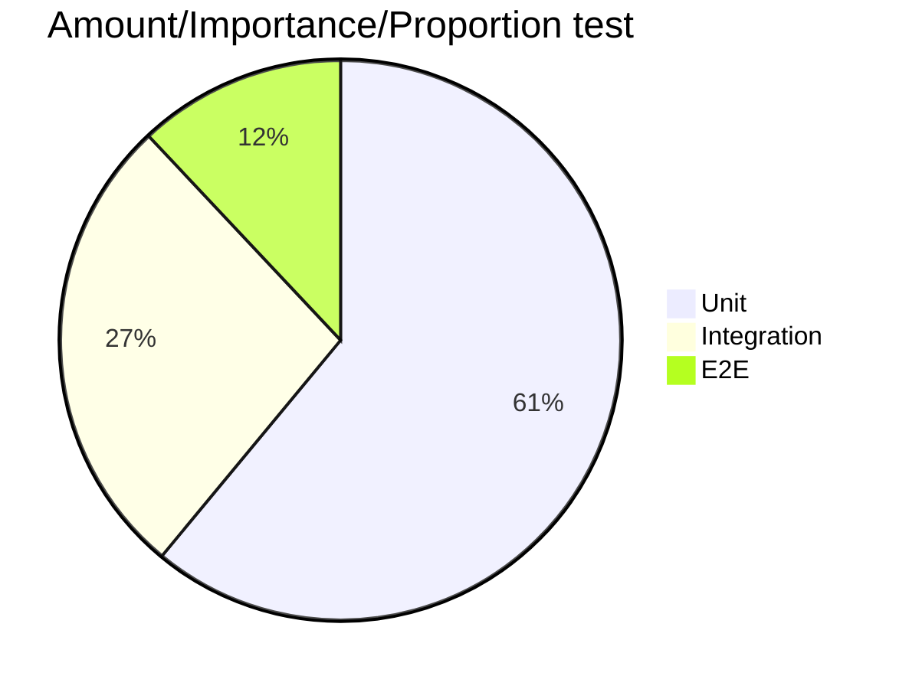

# Testing Concepts

## Introduction
This document provide some annotations and reflexions regarding code testing, particularly in C# .net environment. Although several resources are provided, it is aimed to be self contained, i.e., it's advised to read the whole document and only afterwards, follow those links the reader want to study in more detail (*disclaimer: with this we don't mean that we expect the reader to blindly believed what we present, rather than we are aware of the endless process of going down the rabbit hole whilst studying documentation which usually leads to dropping the case of study and a whole lot of frustration*). With this in mind, user can find the complete bibliography at the end of the document.

### What is a Unit?
We quote some of the most common resources:
 > In procedural programming, a unit could be an entire module, but it is more commonly an individual function or procedure. In object-oriented programming, a unit is often an entire interface, such as a class, or an individual method.
 >
 >*[Wikipedia](https://en.wikipedia.org/wiki/Unit_testing#:~:text=Unit%20tests%20are%20typically%20automated,an%20individual%20function%20or%20procedure.)*  

> The primary goal of unit testing is to take the smallest piece of testable software in the application, isolate it from the remainder of the code, and determine whether it behaves exactly as you expect…
>
>*MSDN*

>Firstly, there is a notion that **unit tests are low-level, focusing on a small part of the** software **system**. Secondly unit tests are usually **written** these days **by the programmers themselves** using their regular tools – the only difference being the use of some sort of unit testing framework. Thirdly unit tests are **expected to be significantly faster** than other kinds of tests.
>
>*[Martin Fowler](https://martinfowler.com/bliki/UnitTest.html)*

Martin Fowler's definition appear as the more rounded and well thought definition (as expected). Condensed as follows.
1. Focus in a small part of the system.
1. Written by the programmers themselves.
1. Expected to run faster.

### Test types
1. Unit testing
    - IO calls are mocked.
    - Smallest scope possible.
2. Component testing (AKA functional testing)
    - Wider scope while keeping minimalistic approach.
3. Integration testing
    - Test include dependencies, otherwise excluded (like database calls)
4. End to End testing (E2E)
    - Test some part of the system working as a whole.
    - Test business logic (behaviour)

Honorable mentions:

- Perfomance testing
- Snapshot testing

## Testing pyramid (Pie chart??)
An issual representation of importance of testing is a pyramid (represented for simplicity with a pie chart bellow).

This is bollocks as statistics show integration tests are actually more effective ([What went wrong with IT industry? Jim Coplien.](https://www.youtube.com/watch?v=gPP7Bleg214&ab_channel=FooCafe)).

> (The idea of TDD is that...) bugs come from units, bugs come from methods, and so, *if the method works then the whole thing must work.* **And it's simply not true**.
>
> *Jim Coplien.*

## Software Defect Removal Efficiency 
Citing Capers Jone 2011's article:

> The most important contributor to the quality of software intensive systems is the quality of components. The most important *single* metric for software quality is that of *defect removal efficiency (DRE)*.

*DRE* metric measures the percentage of defects found removed previous to delivery of the software.

This can be measured as follows:

    DRE:= Defects found internally / (( Defects found internally + Defects found externally) × 100.)

Where the defects found externally are calculated over a given period of time (e.g. in Capers's original paper, over 90 days).

Citing Capers Jones's paper again.

> *High levels of DRE cannot be achieved using testing alone.* Pre-test inspections and static analysis are necessary to top 95% in deffect removal efficiency.

### The function point metric
Through the 1970's IBM developed the function point metric *"because it was necessary to analyze non-coding defects and non-coding development activities as well"*. It measures the functionality from the user's point of view, or, according to Allan J. Albrecht (the computer scientist that first developed it), *function point metrics gives a dimensionless number defined defined in function points which we have found to be an effective realtive measure of function value we deliver to our customer.*

As of 2011, *DRE* average in the United States was 85%.
## TDD
>Test-first fundamentalism is like abstinence-only sex ed: An unrealistic, ineffective morality campaign for self-loathing and shaming
>
>*David Heinemeier Hansson*

## Bibliography
1. [Unit testing. Wikipedia](https://en.wikipedia.org/wiki/Unit_testing#:~:text=Unit%20tests%20are%20typically%20automated,an%20individual%20function%20or%20procedure.)
1. [UnitTest. Martin Fowler.](https://martinfowler.com/bliki/UnitTest.html)
1. [What went wrong with IT industry? Jim Coplien.](https://www.youtube.com/watch?v=gPP7Bleg214&ab_channel=FooCafe)
1. [Software Defect Removal Efficiency](https://www.academia.edu/56742144/Software_defect_removal_efficiency)
1. [The little Mocker. Robert Martin.](https://blog.cleancoder.com/uncle-bob/2014/05/14/TheLittleMocker.html)
1. [Mocks Aren't Stubs. Martin Fowler.](https://martinfowler.com/articles/mocksArentStubs.html)
1. [Uncle Bob and Jim Coplien debate TDD.](https://www.youtube.com/watch?v=KtHQGs3zFAM&ab_channel=toalexsmail)
1. [TDD for those who don't need it. Chew Choon Keat](https://www.youtube.com/watch?v=a6oP24CSdUg&ab_channel=SingaporeGophers)