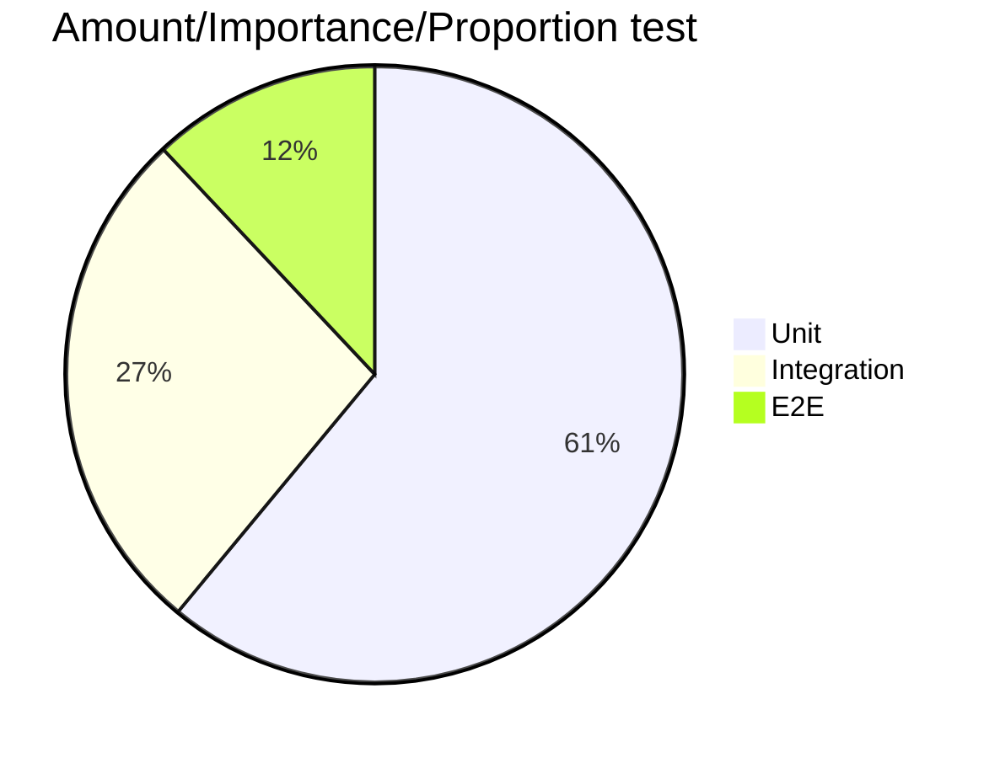

# Unit Testing Concepts

## Introduction

### What is a Unit?
We quote some of the most common resources:
 > In procedural programming, a unit could be an entire module, but it is more commonly an individual function or procedure. In object-oriented programming, a unit is often an entire interface, such as a class, or an individual method.
 >
 >*[Wikipedia](https://en.wikipedia.org/wiki/Unit_testing#:~:text=Unit%20tests%20are%20typically%20automated,an%20individual%20function%20or%20procedure.)*  

> The primary goal of unit testing is to take the smallest piece of testable software in the application, isolate it from the remainder of the code, and determine whether it behaves exactly as you expect…
>
>*[MSDN](https://msdn.microsoft.com/en-us/library/aa292197(v=vs.71).aspx)*

>Firstly there is a notion that **unit tests are low-level, focusing on a small part of the** software **system**. Secondly unit tests are usually **written** these days **by the programmers themselves** using their regular tools – the only difference being the use of some sort of unit testing framework. Thirdly unit tests are **expected to be significantly faster** than other kinds of tests.
>
>*[Martin Fowler](https://martinfowler.com/bliki/UnitTest.html)*

Martin Fowler's definition appear as the more rounded and well thought definition (as expected). Condensed as follows.
1. Focus in a small part of the system.
1. Written by the programmers themselves.
1. Expected to run faster.

### Test types
1. Unit testing
    - IO calls are mocked.
    - Smallest scope possible.
2. Component testing (AKA functional testing)
    - Wider scope while keeping minimalistic approach.
3. Integration testing
    - Test include dependencies, otherwise excluded (like database calls)
4. End to End testing (E2E)
    - Test some part of the system working as a whole.
    - Test business logic (behaviour)

Honorable mentions:

- Perfomance testing
- Snapshot testing

## Testing pyramid (Pie chart??)
An issual representation of importance of testing is a pyramid (represented for simplicity with a pie chart bellow).

This is bollocks as statistics show integration tests are actually more effective ([What went wrong with IT industry? Jim Coplien.](https://www.youtube.com/watch?v=gPP7Bleg214&ab_channel=FooCafe)).

> (The idea of TDD is that...) bugs come from units, bugs come from methods, and so, *if the method works then the whole thing must work.* **And it's simply not true**.
>
> *Jim Coplien.*

## TDD
>Test-first fundamentalism is like abstinence-only sex ed: An unrealistic, ineffective morality campaign for self-loathing and shaming
>
>*David Heinemeier Hansson*

## Bibliography
1. [UnitTest. Martin Fowler.](https://martinfowler.com/bliki/UnitTest.html)
1. [What went wrong with IT industry? Jim Coplien.](https://www.youtube.com/watch?v=gPP7Bleg214&ab_channel=FooCafe)
1. [The little Mocker. Robert Martin.](https://blog.cleancoder.com/uncle-bob/2014/05/14/TheLittleMocker.html)
1. [Mocks Aren't Stubs. Martin Fowler.](https://martinfowler.com/articles/mocksArentStubs.html)
1. [Uncle Bob and Jim Coplien debate TDD.](https://www.youtube.com/watch?v=KtHQGs3zFAM&ab_channel=toalexsmail)
1. [TDD for those who don't need it. Chew Choon Keat](https://www.youtube.com/watch?v=a6oP24CSdUg&ab_channel=SingaporeGophers)